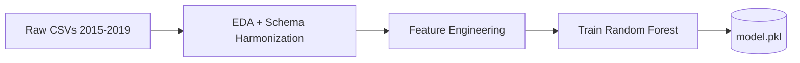
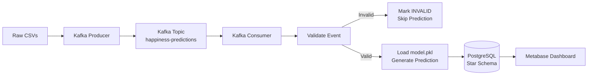

# World Happiness — Streaming ETL with Apache Kafka & ML


> **Author:** Juan Pablo Gómez Veira  
> **Course:** ETL | Data Engineering and Artificial Intelligence  
> **Year:** 2026-1

---

## Project Overview

This project implements a **streaming ETL pipeline** that ingests raw World Happiness Report data (2015–2019) through Apache Kafka, validates each event, runs real-time predictions using a pre-trained Random Forest regression model, and stores results in a PostgreSQL star-schema database. A Metabase dashboard visualizes the predictions and KPIs.

The pipeline is fully containerized with Docker Compose and can be run with a single command.

---

## Architecture

The system is split into two independent processes:

### Offline (Batch) — Model Training


### Streaming (Real-time) — Inference Pipeline


### Infrastructure
```
Docker Compose
├── Zookeeper          (port 2181)
├── Kafka Broker       (port 9092)
├── PostgreSQL 16      (port 5433)
└── Metabase           (port 3000)
```

---

## Project Structure

```
workshop03/
├── data/
│   ├── raw/                    # Original CSVs (2015–2019)
│   └── processed/              # Harmonized dataset (EDA notebook output)
├── notebooks/
│   ├── eda.ipynb               # Part 1: EDA + Cleaning + Harmonization
│   └── model_training.ipynb    # Part 2: Feature Engineering + Model Training
├── kafka/
│   ├── producer.py             # Streams raw CSV data to Kafka topic
│   └── consumer.py             # Validates, predicts, stores in DB
├── models/
│   └── model.pkl               # Serialized Random Forest (scikit-learn)
├── sql/
│   ├── create_tables.sql       # Star schema DDL
│   └── kpis.sql                # Dashboard KPI queries
├── dashboards/
│   └── Happiness Predictions KPIs.png   # Metabase dashboard screenshot
├── docker-compose.yml          # All services (ZK, Kafka, PG, Metabase)
├── .env                        # Environment variables (gitignored)
├── .python-version             # Python 3.12
├── pyproject.toml              # uv project configuration
├── requirements.txt            # Pinned dependencies
└── README.md                   # You are here
```

---

## Data Cleaning Decisions

The five CSV files use different column naming conventions and contain different sets of columns across years. The key decisions were:

| Issue | Decision | Justification |
|---|---|---|
| Column name variations (e.g., `Happiness Score` vs `Score` vs `Happiness.Score`) | Mapped to unified names | 9 core concepts exist across all years |
| Confidence measure columns (`Standard Error`, `Lower/Upper CI`, `Whisker.high/low`) | Dropped | Each year uses a different metric — incompatible |
| `Region` column (only 2015–2016) | Dropped, continent derived via `country_converter` | Missing from 2017–2019 |
| `Dystopia Residual` (only 2015–2017) | Dropped | Not present in 2018–2019 |
| 1 missing value in `corruption` (UAE 2018) | Filled with column mean (0.1254) | Single missing value; minimal impact on distribution |
| Country name variants (e.g., "Hong Kong" vs "Hong Kong S.A.R., China") | Preserved as-is | Country is metadata, not a model feature |
| Zero values in health/gdp/freedom (5–6 rows) | Kept as genuine | Represent real low indicators (e.g., Somalia GDP≈0) |

---

## Feature Engineering

| Decision | Choice | Justification |
|---|---|---|
| **Target** | `happiness_score` | Workshop requirement |
| **Features** (6) | `gdp, family, health, freedom, generosity, corruption` | Matches the Kafka JSON format; no continent lookup needed |
| **Excluded:** `happiness_rank` | Target leakage | Correlation of -0.99 with target |
| **Excluded:** `country` | 170 categories | Not a causal predictor |
| **Excluded:** `continent` | Optional | Adding continent only improved R² by +0.04 but adds consumer complexity |
| **Excluded:** `year` | Temporal metadata | Not a causal driver |
| **Scaling** | `StandardScaler` (post-split) | Consistent handling across feature scales |

### Model Performance

| Model | R² | MAE | RMSE |
|---|---|---|---|
| Linear Regression | 0.74 | 0.43 | 0.57 |
| Decision Tree | 0.72 | 0.49 | 0.59 |
| **Random Forest** ✅ | **0.78** | **0.41** | **0.52** |

**Selected model:** `RandomForestRegressor` (100 estimators, max_depth=10, random_state=42)  
**Split:** 70% training / 30% testing

---

## Kafka Pipeline

### Producer (`kafka/producer.py`)

1. Reads raw CSV files from `data/raw/` (2015–2019)
2. Maps different column names to a unified schema
3. Converts numpy types to native Python (NaN → JSON `null`)
4. Streams each row one-by-one to Kafka topic `happiness-predictions`

**JSON format sent:**
```json
{
  "country": "Colombia",
  "year": 2019,
  "gdp": 1.2,
  "family": 0.8,
  "health": 0.9,
  "freedom": 0.6,
  "generosity": 0.3,
  "corruption": 0.1,
  "actual_happiness_score": 6.2
}
```

### Consumer (`kafka/consumer.py`)

Per-event processing flow:

1. **Receive** from Kafka topic
2. **Store raw event** in `raw_happiness_events` (status = `RECEIVED`)
3. **Populate** `dim_raw_event` dimension
4. **Validate** against required schema:
   - Missing fields → `INVALID_SCHEMA`
   - Wrong data types → `INVALID_SCHEMA`
   - Null/NaN in numeric fields → `INVALID_VALUES`
5. **On failure** → update status, commit, **skip prediction** (never crashes)
6. **Extract features** in model order: `[gdp, family, health, freedom, generosity, corruption]`
7. **Predict** using `model.pkl`
8. **On prediction error** → mark `PREDICTION_ERROR`, skip
9. **UPSERT** `dim_country` and `dim_date`
10. **INSERT** into `fact_predictions` with `raw_event_id` link
11. **Mark** as `VALID`

### Validation & Error Handling

| Status | Meaning | Action Taken |
|---|---|---|
| `RECEIVED` | Initial state after Kafka reception | Stored, not yet validated |
| `VALID` | All checks passed | Prediction stored in fact table |
| `INVALID_SCHEMA` | Missing field or wrong type | Stored in raw table, prediction skipped |
| `INVALID_VALUES` | Null in required numeric field | Stored in raw table, prediction skipped |
| `PREDICTION_ERROR` | Model failed to predict | Stored in raw table, prediction skipped |

**End-to-end result:** 782 raw events → 781 VALID predictions + 1 INVALID_VALUES (UAE 2018 — missing corruption value)

---

## Database Schema

The database follows a **star schema** design for analytical performance.

### Entity Relationship

```
fact_predictions
├── raw_event_id  →  raw_happiness_events.raw_event_id
├── country_id    →  dim_country.country_id
├── date_id       →  dim_date.date_id
└── actual_score, predicted_score, prediction_error, prediction_timestamp

dim_raw_event
└── raw_event_id  →  raw_happiness_events.raw_event_id
```

### Tables

| Table | Type | Rows | Purpose |
|---|---|---|---|
| `raw_happiness_events` | Raw | 782 | Original Kafka messages + processing status |
| `dim_raw_event` | Dimension | 782 | Links fact to raw event metadata |
| `dim_country` | Dimension | 170 | Country dimension |
| `dim_date` | Dimension | 5 | Year dimension |
| `fact_predictions` | Fact | 781 | Prediction results linked to all dimensions |

---

## Dashboard

The dashboard was built with **Metabase** (self-hosted, connects directly to PostgreSQL). It provides four key performance indicators as specified by the workshop:

1. **Average Prediction Error** — overall MAE across all predictions
2. **Predictions by Country** — prediction count and average error per country
3. **Predicted vs Actual Score** — scatter plot comparing predictions to ground truth
4. **Trends Over Time** — average actual vs predicted scores from 2015–2019


---

## Setup Instructions

### Prerequisites

- [Docker](https://docs.docker.com/engine/install/) and [Docker Compose](https://docs.docker.com/compose/install/) (v2+)
- Python 3.12+
- [uv](https://docs.astral.sh/uv/) (fast Python package manager)

### Quick Start

```bash
# 1. Clone the repository
git clone https://github.com/YOUR_USERNAME/workshop03.git
cd workshop03

# 2. Install Python dependencies
uv sync

# 3. Copy environment variables
cp .env.example .env
# Edit .env if needed (defaults work for local Docker setup)

# 4. Start all services
docker compose up -d

# 5. Create Kafka topic and database tables
docker exec kafka kafka-topics --create \
  --topic happiness-predictions \
  --bootstrap-server localhost:9092 \
  --partitions 1 --replication-factor 1
docker exec -i postgres psql -U workshop -d happiness_predictions < sql/create_tables.sql

# 6. Run the consumer (Terminal 1)
uv run python kafka/consumer.py

# 7. Run the producer (Terminal 2)
uv run python kafka/producer.py

# 8. Open the dashboard at http://localhost:3000
#    Credentials: admin@workshop.local / workshop123!
```

### Reproducing Model Training (Optional)

```bash
# Run notebooks in order
uv run jupyter notebook notebooks/eda.ipynb
uv run jupyter notebook notebooks/model_training.ipynb
```

### Shutting Down

```bash
docker compose down
```

---

## Tech Stack

| Component | Technology |
|---|---|
| **Streaming** | Apache Kafka (Confluent 7.6.1) |
| **Database** | PostgreSQL 16 |
| **ML Model** | Random Forest Regressor (scikit-learn) |
| **Dashboard** | Metabase |
| **Producer/Consumer** | Python (kafka-python-ng) |
| **DB Connection** | SQLAlchemy + psycopg2 |
| **EDA & Training** | Jupyter, Pandas, Matplotlib, Seaborn, Plotly |
| **Containerization** | Docker Compose |
| **Package Manager** | uv |
